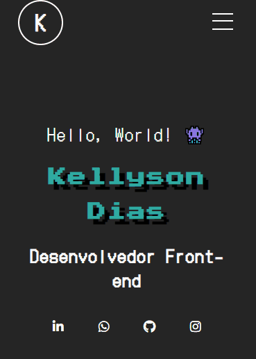

# Meu portfólio 💾
Este é meu portfólio pessoal, onde eu coloco as minhas experiências como desenvolvedor de software em geral!

Eu gosto de usar meu portfólio como um laboratório para explorar as minhas hard skills de front-end/design e criatividade, portanto o site está em constante mudança!

## Versão mobile

## Tecnologias utilizadas
- HTML
- CSS
